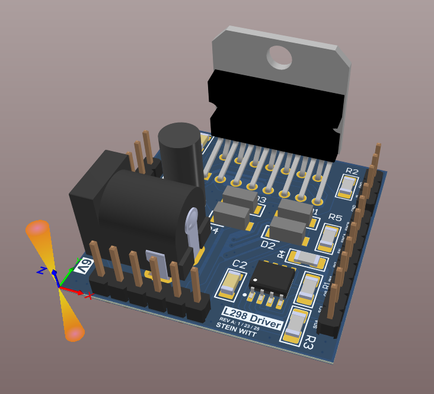
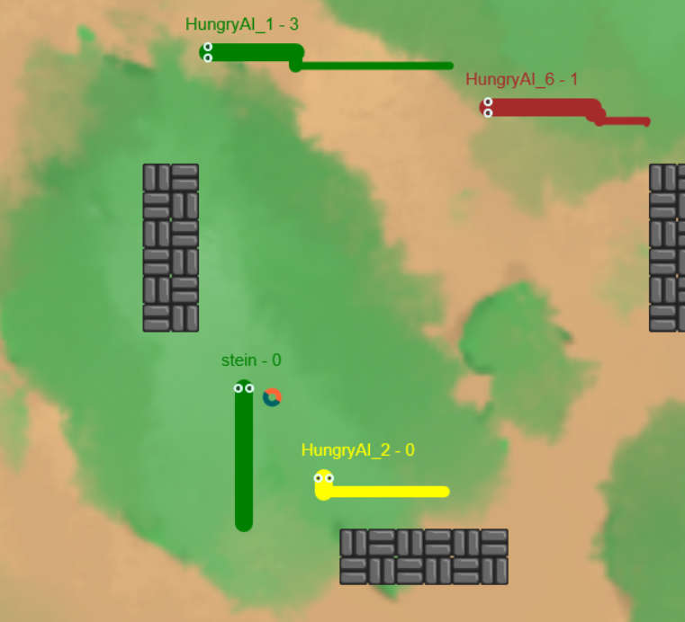

<!-- HERO -->
<h1 align="center">Hi, I'm Stein!</h1>

Mechanical Engineering Student @ University of Utah • Minor in CS • Semiconductor & PCB/Embedded Systems Experience

  

<!-- ABOUT -->
### 👋 About Me
I am a Mechanical Engineering Student at the University of Utah with a Minor in Computer Science graduating in May of 2026 with a strong interest in PCB Design, Robotics, and Embedded Systems. Outisde of engineering, I am an avid skier/biker and I compete in the US Hard Enduro Series Motorcycle races! I love building devices that align with my hobbies of skiing and biking in my free time. If you want to talk,
please reach out on LinkedIn!

<!-- OPTIONAL tech strip -->

  &nbsp;
  &nbsp;
  &nbsp;
  &nbsp;
  &nbsp;
  

<!-- SKILLS (keep your bullets, they scan well) -->
### 🛠️ Skills
- **🤖 Embedded & Firmware:** C · Zephyr RTOS · FreeRTOS · BLE (nRF52) · LoRa (SX126x) · USB-C charging · SPI/I²C/UART  
- **⚡ Electronics & EDA:** Altium Designer · Schematic & PCB layout · QFN/BGA packaging · Oscilloscopes · Logic analyzers  
- **💻 Programming & Tools:** Python · MATLAB · Git · Linux/Unix · SQL · Excel · C# (.NET) · Java  
- **⚙️ Mechanical:** SolidWorks (CSWA) · Mechatronics · 3D printing · Mills/Lathes  
- **📐 Standards & Methods:** IPC-7351 footprints · PID control · Six Sigma / SPC charts  
- **📜 Certifications:** DoD T3 Secret Security Clearance · SolidWorks CSWA · Firefighter Type II

### 🤖 Robotics Projects
<table>
  <tr>
    <td width="260" valign="top">
      
    </td>
    <td valign="top">
      <b>Mechatronics Competition Robot</b> 
      <a href="https://github.com/steinwitt/mechatronics">View More Here</a> 
      Developed electronics and CAD design of a competition mechatronics robot 
       
       
       <b>Skills Used:</b>&nbsp; 
      
      
    </td>
  </tr>
</table>

### ⚡ Electronics Projects
<table>
  <tr>
    <td width="260" valign="top">
      
    </td>
    <td valign="top">
      <b>I²C Controlled Motor Driver PCB</b> 
      <a href="https://github.com/steinwitt/motor_driver_pcb">View More Here</a> 
      Designed and manufactured a motor driver PCB with I²C temperature monitoring. 
       <b>Skills Used:</b>&nbsp; 
      
      
      
    </td>
  </tr>

  <tr>
    <td width="260" valign="top">
      
    </td>
    <td valign="top">
      <b>RescueNET Transceiver</b> 
      <a href="https://github.com/steinwitt/rescuenet">View More Here</a> 
      Currently designing a PCB that detects when snowmobilers are stuck upside down, which induces suffocation, 
      and sends an emergency signal to riders nearby via LoRa Radio. 
       <b>Skills Used:</b>&nbsp; 
      
      
      
    </td>
  </tr>
</table>

### 💻 C# Projects
<table>
  <tr>
    <td width="260" valign="top">
      
    </td>
    <td valign="top">
      <b>C#(.NET) Snake Game Client and MySQL Database</b> 
      <a href="https://github.com/steinwitt/snake_game">View More Here</a> 
      Built client (and some server) side of a snake game using C# (.NET) and implemented my own application layer protocol on top of TCP. 
       
       
      <b> Skills Used:</b>&nbsp;
      
      
    </td>
  </tr>
</table>

    
