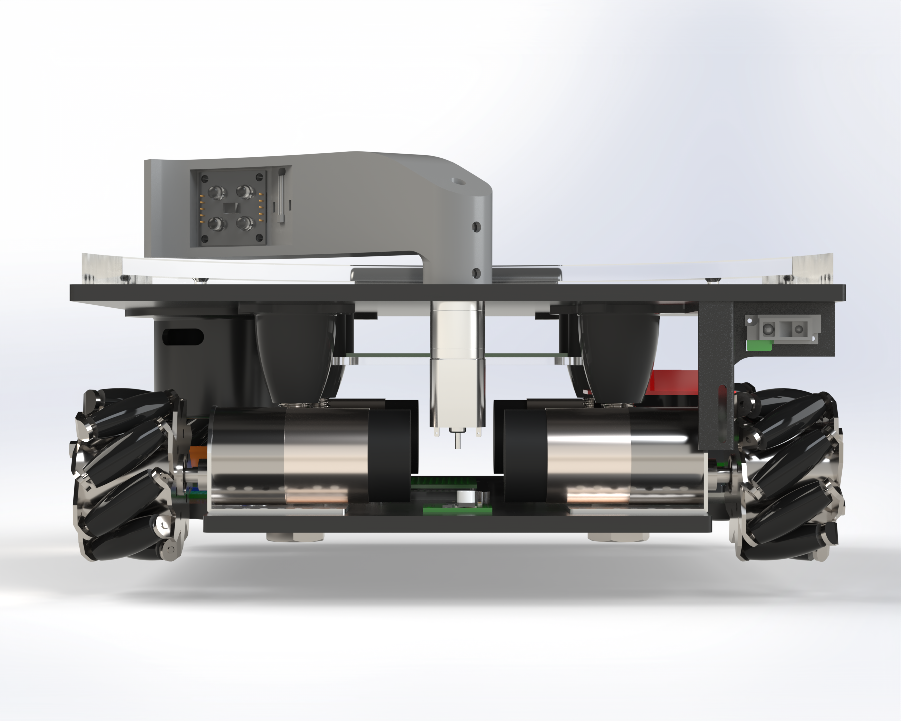
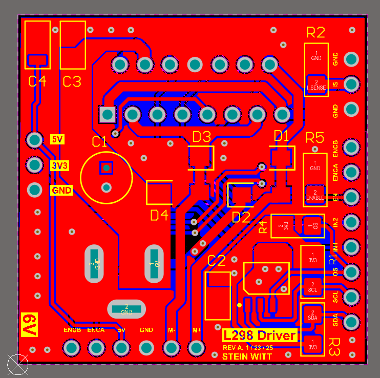
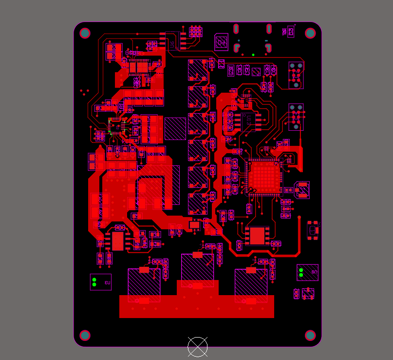

<h1 align="center">Hi, I'm Stein!</h1>

  Mechanical Engineering Student @ University of Utah

  <b>🤳 Connect with me</b>&nbsp;&nbsp;
  

---

### 👋 About Me
Mechanical Engineering Student at the University of Utah with a Minor in Computer Science graduating in May of 2026 with a strong interest in PCB Design, Robotics, and Embedded Systems.

### 🛠️ Skills
- **🤖 Embedded & Firmware:** C · Zephyr RTOS · FreeRTOS · BLE (nRF52) · LoRa (SX126x) · USB-C charging · SPI/I²C/UART  
- **⚡ Electronics & EDA:** Altium Designer · Schematic & PCB layout · QFN/BGA packaging · Oscilloscopes · Logic analyzers  
- **💻 Programming & Tools:** Python · MATLAB · Git · Linux/Unix · SQL · Excel · C# (.NET) · Java  
- **⚙️ Mechanical:** SolidWorks (CSWA) · Mechatronics · 3D printing · Mills/Lathes  
- **📐 Standards & Methods:** IPC-7351 footprints · PID control · Six Sigma / SPC charts  
- **📜 Certifications:** DoD T3 Secret Security Clearance · SolidWorks CSWA · Firefighter Type II

---

### 🤖 Robotics Projects

<table>
  <tr>
    <td width="140" valign="top">
      
    </td>
    <td valign="top">
      <b>Mechatronics Competition Robot</b> 
      <a href="https://github.com/steinwitt/mechatronics">Robot Repo</a> 
      Developed electronics and CAD design of a competition mechatronics robot
    </td>
  </tr>
</table>

### ⚡ Electronics Projects

<table>
  <tr>
    <td width="140" valign="top">
      
    </td>
    <td valign="top">
      <b>I2C Controlled Motor Driver PCB</b> 
      <a href="https://github.com/steinwitt/motor_driver_pcb">PCB Repo</a> 
      Designed and manufactured a motor driver PCB with I²C temperature monitoring.
    </td>
  </tr>

  <tr>
    <td width="140" valign="top">
      
    </td>
    <td valign="top">
      <b>RescueNET Transceiver</b> 
      <a href="https://github.com/steinwitt/rescuenet">PCB Repo</a> 
      Designing a life-saving PCB to send emergency alerts when snowmobilers are
      suffocating.
    </td>
  </tr>
</table>

